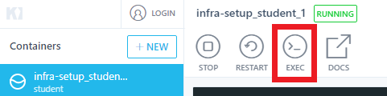

# Windows Pre-requisites

If you're running Docker Desktop for Windows, make sure you have a default machine created, and that it has at least 2 threads assigned to it.

If you're running Docker Toolbox, make sure you have a default machine created, that it has at least 2 threads assigned to it, and that Kitematic is running.


## Setup docker-compose "student" container environment 

If you have cloned the repository, browse to k8s-workshop/infa-setup. Otherwise, paste the 
following into a file named Dockerfile.

```
FROM google/cloud-sdk:slim

RUN git config --system credential.'https://source.developers.google.com'.helper gcloud.sh

ENV HELM_VERSION=v2.16.12

RUN  apt-get update \
    && apt-get install -y wget curl
    #&& rm -rf /var/lib/apt/lists/*

RUN wget https://get.helm.sh/helm-${HELM_VERSION}-linux-amd64.tar.gz 
        

RUN  tar -zxvf helm-${HELM_VERSION}-linux-amd64.tar.gz \
    && mv linux-amd64/helm /usr/local/bin/helm2 \
    && curl -LO "https://storage.googleapis.com/kubernetes-release/release/$(curl -s https://storage.googleapis.com/kubernetes-release/release/stable.txt)/bin/linux/amd64/kubectl" \
    && chmod +x ./kubectl \
    && mv ./kubectl /usr/local/bin/kubectl


CMD ["/bin/bash", "-l", "-c", "tail", "-f", "/dev/null"]
```

And paste the following into a file named docker-compose.yml.
```
version: "3"
services:
  student:
   image: student
   # Comment the volumes out if you lack the permissions to map volumes
   # or modify your Docker App settings to allow the paths to be shared.
   volumes:
    - .:/data
    - ~/.kube:/root/.kube
   command: ["/bin/bash", "-l", "-c", "tail", "-f", "/dev/null"] 
   entrypoint: ""
   tty: true   
   working_dir: /data
   ports:
   - 8090:80 

```

1. Run `docker build -t student .` If this is slow, you can use the pre-built kbroughton/student image
by replacing "student" with "kbroughton/student" in docker-compose.yml
2. Run `docker-compose -f .\docker-compose.yml up -d`

The remainder of this workshop can be run from the docker-compose "student" container. This replaces the
instructions for the student VM (Virtualbox).

## (Optional) Install Kind

Kind needs to be run from a windows native environment, not from within a container.

[kubectl](https://kubernetes.io/docs/tasks/tools/install-kubectl/#install-kubectl-binary-with-curl-on-windows)

[Kind](https://kind.sigs.k8s.io/docs/user/quick-start/#installation)
Execute the following steps in order:

1. Change setup.sh line ending to LF. This can be done with Notepad++, for example.
2. Run `kind create cluster`. This will take a few minutes. Make sure you have at least 5GB of disk space available.
3. Exec into the infra-setup (docker-compose) container.  
   `docker ps | grep student`  
   `docker exec -it $CONTAINER_ID bash`

* On Kitematic, this can be done by clicking the exec button.
 

* On Docker Desktop, this can be done by running `docker ps`, copying the container's ID, and then running `docker exec -it replace-this-with-container-id bash`

4. Run `./setup.sh --kind`
5. Run `kubectl apply -f apps-ingress/apps-ingress.yaml`. It should return either unchanged or created. If it returns an InternalServer error, wait a few minutes and try again.

## Validation

To verify everything worked, run `kubectl get pods`. This should return the pods status as Running or ContainerCreating.

If your pods get stuck on Pending, it's most likely a lack of resources. You need to delete both containers, close Kitematic or Docker Desktop, increase the CPU and RAM limit and re-do all the steps.

## Expose Vulnerable Apps

The instructor, or whomever ran the infra-setup/setup.sh script to create the cluster, should have supplied you 
with a k8s-training-config file. This has the same format as what you may have in `~/kube/config` but with
credentials to target the training k8s cluster.

If running from within the "student" container, add the option "--address 0.0.0.0" after "port-forward" in the line below.

* Run `kubectl port-forward -n ingress-nginx svc/ingress-nginx-controller 80:80`
* Use your regular browser to view the services.
   * mailbox-service.oss-k8s-security.cloudsec.training
   * k8s-mdbook.oss-k8s-security.cloudsec.training

If your connection stops working, check that the port-forward shell is still running. You may have to run it again.
